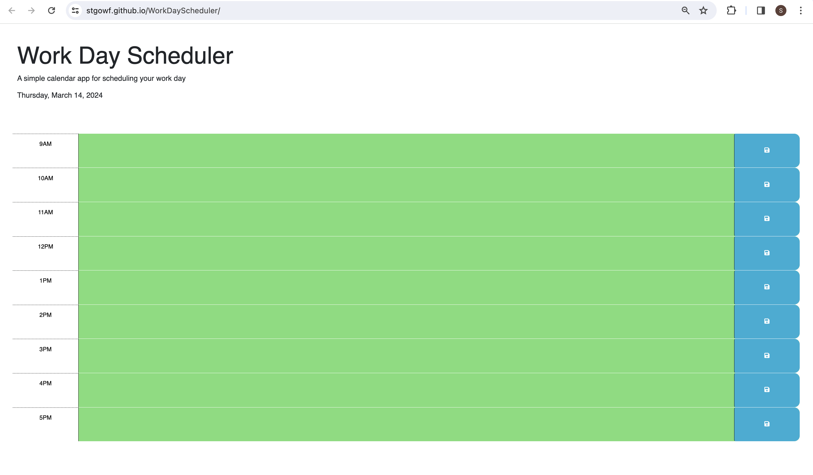

# Work Day Scheduler

## Description
The Work Day Scheduler is a simple, elegant web application designed for employees with busy schedules. This application allows users to add, save, and delete events for each hour of the workday. Powered by jQuery and Day.js, it features dynamically updated HTML and CSS, providing an intuitive and user-friendly interface for time management.

## Features
- Display the current day at the top of the calendar.
- Time blocks for standard business hours (9 AM - 5 PM).
- Each time block is color-coded to indicate whether it is in the past, present, or future.
- Clickable time blocks where users can enter an event.
- Save buttons for each time block to save events to local storage.
- Events persist even after refreshing the page.

## Getting Started
To view the website locally, clone this repository and open index.html in your web browser.

## Screenshot

## Live Demo
Experience the Work Day Scheduler [here](https://stgowf.github.io/WorkDayScheduler/).

## Usage
To use the Work Day Scheduler, follow these steps:
1. **View the current day**: At the top of the calendar, today's date is displayed.
2. **Add an event**: Click into a time block, enter your event details, and press the save button on the right.
3. **Save an event**: Your events are saved to local storage and will persist upon refreshing the page.

## Getting Started
To view the website locally, clone this repository and open index.html in your web browser.

## Contributing
Contributions are welcome! Please feel free to fork the repository and open a pull request with your proposed changes. Your suggestions and improvements are highly appreciated. Thank you for your support and contribution to this project.

Thank you for checking out my Work Day Scheduler!
